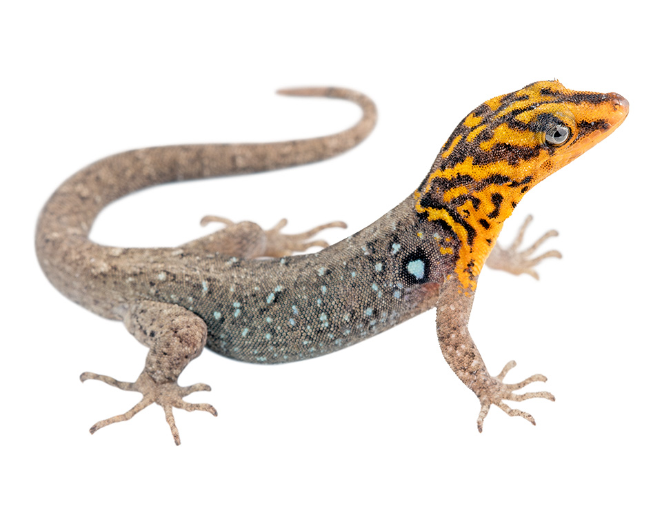
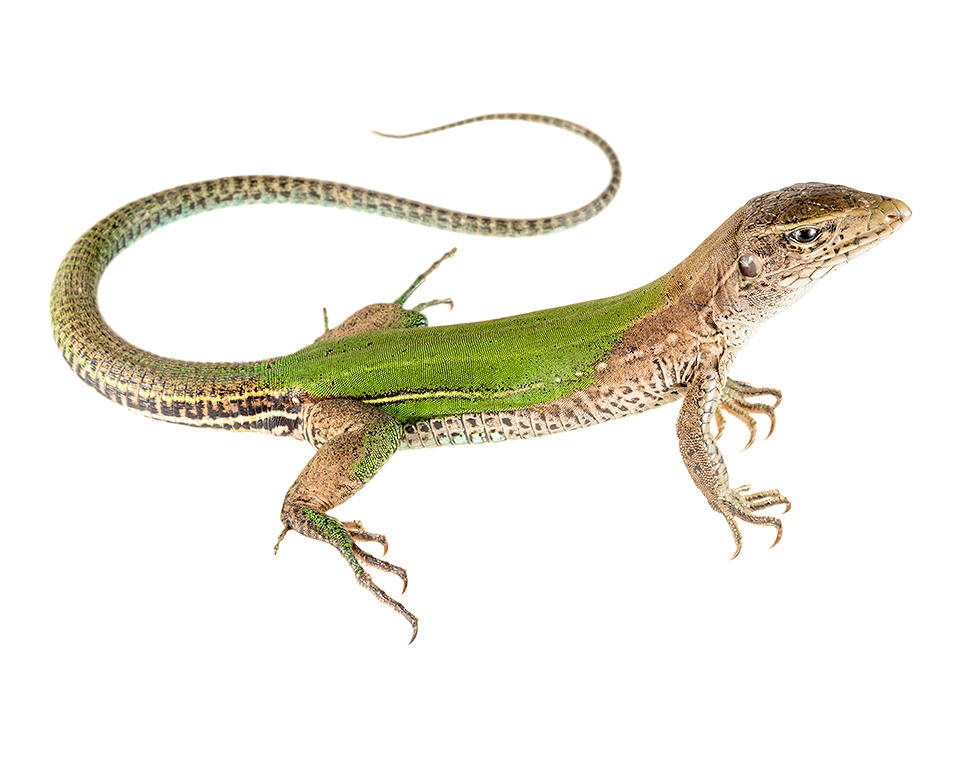

<style>
#main-img-left {
 width: 40%;
}
#main-img-center {
 width: 10.3%;
}
#main-img-right {
 width: 14%;
}

.main p {
font-size: $if(main_textsize)$$main_textsize$$else$150px$endif$;
font-family: $if(main_fontfamily)$$main_fontfamily$$else$Special Elite$endif$;
text-align: $if(main_textalign)$$main_textalign$$else$center$endif$;
margin: 0;
position: absolute;
top: 50%;
-ms-transform: translateY(-50%);
transform: translateY(-50%);
margin-left: 0;
}

</style>


```{r, include=FALSE}

######### Here is the command to generate this .Rmd template ##########

######## rmarkdown::draft(file = "mydraft.Rmd", template = "posterdown_betterport", package = "posterdown", create_dir= FALSE) ###########################


knitr::opts_chunk$set(echo = FALSE,
                      dpi = 300,
                      warning = FALSE,
                      tidy = FALSE,
                      message = FALSE,
                      fig.align = 'center',
                      out.width = "100%")
options(knitr.table.format = "html")


```

<br>

# <span style="color: #0b4545;">Background</span>

## The allocation of energy to reproduction depends on maternal size, which in turn depends on environmental factors experienced throughout the life of the mother


```{r, fig.cap = "Path models depicting relationships among body temperature and life-history traits derived from optimality models (see text for details). Abbreviation in the path diagrams are as follows: BT, body temperature; CS, clutch size; FS, maternal length; HS, hatchling/neonate length; PP, primary production; PR, annual precipitation"}


knitr::include_graphics("figure1.jpeg")


```

<br>

## Because growth and body size are affected by environmental conditions, the covariation among abiotic factors should shape the evolution of life-history traits


 &nbsp;&nbsp;&nbsp;&nbsp;&nbsp;&nbsp;&nbsp;&nbsp;&nbsp;&nbsp;&nbsp;&nbsp;&nbsp;&nbsp;&nbsp;&nbsp;&nbsp;&nbsp;&nbsp;&nbsp;&nbsp;&nbsp;&nbsp;


# <span style="color: #0b4545;">Methods and Data Analysis</span>

<br>

## We used published estimates of life histories for 486 species of lizards, belonging to 34 families

<br>

```{r}
knitr::include_graphics("methods_figure.jpeg")
```

## Phylogenetic path analysis is an effective way to test hypotheses about multiple causes of evolutionary patterns

## [`phylopath` `r emo::ji("package")`](https://cran.r-project.org/web/packages/phylopath/index.html) of `r icons::fontawesome("r-project")` v. 4.1.1

<br>

# <span style="color: #0b4545;">Results and Discussion</span>


## We discovered that precipitation, rather than temperature, has shaped the evolution of the life history


```{r, fig.cap = "Best-fit models of the evolution of reproductive traits considering body temperature (a) and environmental temperature (b) as independent variables. Thicker arrows indicate stronger effects. Values in parentheses denote the standard errors of the path coefficients"}

knitr::include_graphics("figure2.jpeg")

```

<br>


```{r, fig.cap = "Relative importance of the causal models describing the evolution of reproductive traits in lizards"}

knitr::include_graphics("figure4.jpeg")

```

<br>

## The absence of a thermal effect on the evolution of reproductive tactics might partially be explained by thermoregulation and local adaptation

```{r, fig.cap = "Evolution of the reproductive output among 669 species of lizards. The dataset used to perform path analyses was reduced to 486 species because we could not extract data of climatic variables for all species present in the phylogeny"}

knitr::include_graphics("figure3.jpeg")

```
<br>

## Our study indicates that precipitation is the most likely driver of the evolution of reproductive traits in lizards

